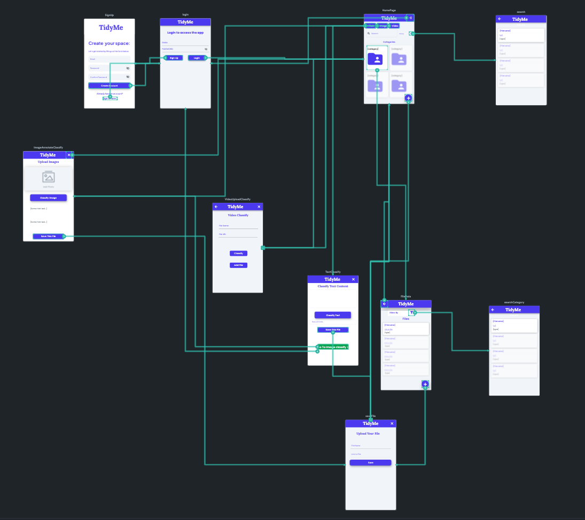

<h1 align="center">
 <br>
 
 </br>
</h1>

## The Problem
The modern world is data driven and the data that we collect in a day is huge. Over time, it gets tedious to manage such large and varied data manually. This often creates a lot of cluttered data, which requires a great manual effort to organize and categorize by the data owner. In this project we are addressing this everyday concern by creating a cloud storage application that helps users to efficiently organize notes (text, PDF), videos and photos by using cutting-edge Artificial Intelligence to classify contents into meaningful categories for the user. 

## Implementation

### Data Collection
1. For videos we used YouTube's robust 8 million [dataset](https://research.google.com/youtube8m/download.html)
  * Train Dataset required
  * Validate Dataset required
  * Test Dataset required
2. For Images we used kaggles's image [dataset](https://www.kaggle.com/datasets/pavansanagapati/images-dataset) with these data:
  * Bikes
  * Cars
  * Cats
  * Dogs
  * Flowers
  * Horses
  * Human
3. For text we used BBC [dataset](http://mlg.ucd.ie/datasets/bbc.html) which consists of:
  * 2225 documents from BBC corresponsing to stories in 5 topics from 2004-2005
  * 5 class labels
    * Business
    * Entertainment
    * Politics
    * Sports
    * Tech
4. Caltech 256 Image [dataset](http://www.vision.caltech.edu/Image_Datasets/Caltech256/)
 * 30K+ images
 * 257 classes
5. Human Action short videos [Dataset](https://www.crcv.ucf.edu/data/UCF101.php), UCF Center of Research in Computer Vision.

### Classification
Once data was collected, we were able to use Google's pre-trained models to test classification & annotation on our datasets which we stored in google cloud buckets.
1. [Video](https://cloud.google.com/video-intelligence/docs/streaming/video-classification) classification
2. [Image](https://cloud.google.com/ai-platform/training/docs/algorithms/image-classification-start) classification
3. [Text](https://cloud.google.com/natural-language/docs/classify-text-tutorial) classification

Google's classification is very reliable and upon testing on our data found that it tracked an accuracy of above 60% for all that is video, image and text.

### Building Application
We used [Flutterflow](https://flutterflow.io) to build our interactive UI which is convenient since it works well with google cloud features including [Firebase](https://firebase.google.com) which will be discussed later.

### Storage
1. Training/testing data (3.15TB)
 * We had 3.15TB worth of data to store and work with therefore we chose google cloud for this as they offered 300 worth of initial credit to use upon creating an account which was more than enough. Data was stored in buckets and within those buckets they were seperated by folders into image, video and text.
2. Database for application
 * We used FireBase which integrates very well with Flutterflow, is robust and also provided security features to ensure secure login for all users of the application.
 * We have three databases:
   * Users: Holds all user information
   * Categories: Contains a list of categories of files that specific users have already classified, we use this for folder generation
   * File Data: Hold all file data for user files with key information that is the category which it falls under as well as annotation which is used for searching.

### Testing Locally

1.	Install an IDE
 * Android Studio IDE and follow [this](https://docs.flutter.dev/get-started/editor?tab=androidstudio) to setup
Setup flutter in your local machine
2. Setup [flutter](https://docs.flutter.dev/get-started/install) in your local machine
3.	Follow [setup](https://docs.flutter.dev/platform-integration/desktop#requirements) depending on your OS
4.	Download the files in the Website folder of this repository
5.	In your editor of choice, navigate to the folder where your downloads are and run these:
```
flutter pub get
flutter packages pub run build_runner build --delete-conflicting-outputs
flutter pub run flutter_launcher_icons:main
```
6.	To enable desktop support on your terminal run:
```MacOS
flutter config --enable-macos-desktop;
```
```Windows
flutter config --enable-windows-desktop;
```
```Linux 
flutter config --enable-linux-desktop;
```
7.	To test run
```flutter devices```
8.	To run:
 * Open the Android Studio.
 * Select the Flutter Device Selection dropdown (in the Toolbar) and choose your operating system name (e.g. macOS, windows, linux).
 * Click on the Run button (looks like a green color play button).


## TidyMe App
After all the groundwork, TidyMe app now allows users to securely login and upload video, text or images for classification annotation as well as saving.

